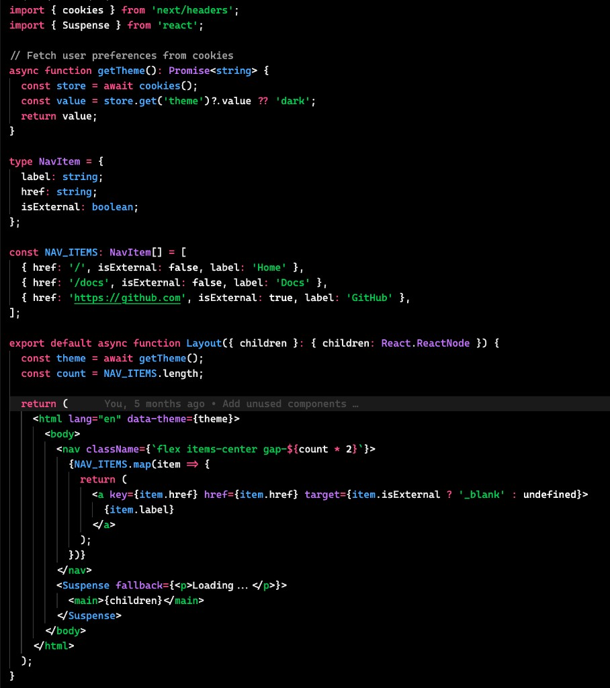
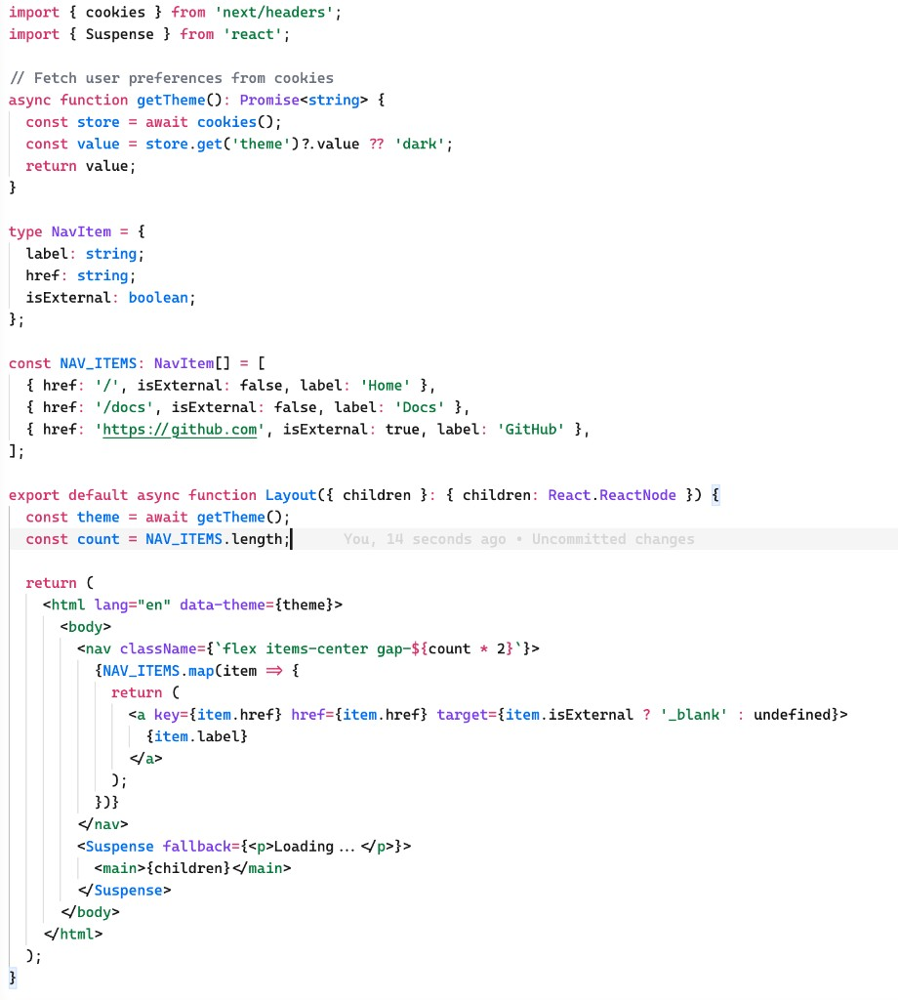

# Vercel Docs Theme

The official Vercel Docs theme for VS Code and Cursor. Dark and light color schemes matching the syntax highlighting used across the [Vercel documentation](https://vercel.com/docs).

## Preview

### Vercel Dark

### Vercel Light

## Themes

- **Vercel Dark** -- Dark theme matching the Vercel docs code blocks
- **Vercel Light** -- Light theme matching the Vercel docs light mode

## Installation

### From Marketplace

Search for "Vercel Docs Theme" in the VS Code or Cursor Extensions marketplace and install the extension by `Vercel`.

### Manual Installation

1. Download or clone this repository
2. Copy the entire folder to your extensions directory:
   - **macOS/Linux**: `~/.vscode/extensions/` or `~/.cursor/extensions/`
   - **Windows**: `%USERPROFILE%\.vscode\extensions\` or `%USERPROFILE%\.cursor\extensions\`
3. Restart your editor
4. Select the theme:
   - Open Command Palette (`Cmd+Shift+P` / `Ctrl+Shift+P`)
   - Type "Color Theme"
   - Select "Vercel Dark" or "Vercel Light"

## Acknowledgments

Created by [Aurora Scharff](https://github.com/aurorascharff). Originally forked from [natemcgrady/vercel-vscode-theme](https://github.com/natemcgrady/vercel-vscode-theme) by Nate McGrady. Inspired by the [Vercel theme](https://ray.so/#padding=64&theme=vercel) from [ray.so](https://ray.so) by [Raycast](https://www.raycast.com/).

## License

MIT -- see [LICENSE](LICENSE) for details.
